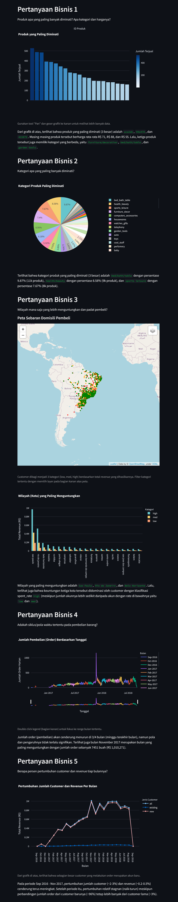

# EDA: Olist E-Commerce Public Dataset
Exploratory Data Analysis (EDA) project that I made as part of Dicoding "Data Science" specialization course. Dataset source can be downloaded directly on [Kaggle](https://www.kaggle.com/datasets/olistbr/brazilian-ecommerce) (Olist Store). Some key concepts I managed to learn:
- Descriptive statistics (measuring central tendency, dispersion, and asymmetry)
- Basic RFM (recency, frequency, monetary) analysis
- Geospatial analysis
- IQR (Inter-Quartile Range) imputation method

## Setup Environment

``` sh
python -m venv .venv
source ./.venv/Scripts/activate
pip install -r requirements.txt
```

## Run Streamlit App

``` sh
streamlit run ./app.py
```

The interactive cloud dashboard can also be accessed [here](https://dico-ds-i2gxvjkzmpxuk9gm96rrea.streamlit.app/).

## Screenshot

**Note:** The detailed steps can be seen directly in the [notebook](notebook.ipynb), the dashboard seems simple because it only contains post-processed data.

<details>
    <summary>Show/hide</summary>
    
</details>